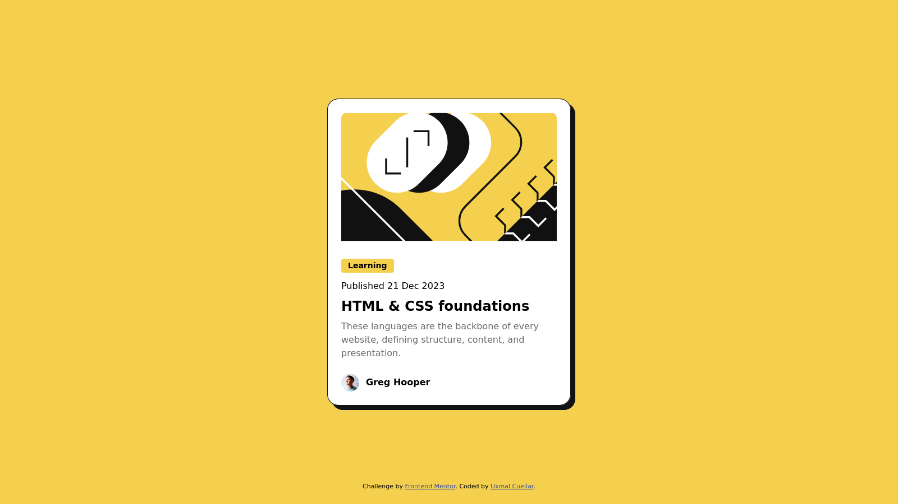

# Frontend Mentor - Blog preview card solution

This is a solution to the [Blog preview card challenge on Frontend Mentor](https://www.frontendmentor.io/challenges/blog-preview-card-ckPaj01IcS). Frontend Mentor challenges help you improve your coding skills by building realistic projects.

## Table of contents

- [Overview](#overview)
  - [The challenge](#the-challenge)
  - [Screenshot](#screenshot)
  - [Links](#links)
- [My process](#my-process)
  - [Built with](#built-with)
  - [What I learned](#what-i-learned)
  - [Useful resources](#useful-resources)
- [Author](#author)

## Overview

### The challenge

Users should be able to:

- See hover and focus states for all interactive elements on the page

### Screenshot



### Links

- Solution URL: [Github repo](https://github.com/UxmalCuellar/blog-preview-card)
- Live Site URL: [Live site URL](https://uxmalcuellar.github.io/blog-preview-card/)

## My process

### Built with

- Semantic HTML5 markup
- CSS custom properties
- SASS

**Note: These are just examples. Delete this note and replace the list above with your own choices**

### What I learned

First time using the clamp function instead of media queries to create a responsive font for the various fonts styles in the blog card preview

```css
body {
  font-size: clamp(14px, 2.5vw, 16px);
```

### Useful resources

- [utopia.fyi](https://utopia.fyi/type/calculator?c=320,18,1.2,1240,20,1.25,5,2,&s=0.75%7C0.5%7C0.25,1.5%7C2%7C3%7C4%7C6,s-l&g=s,l,xl,12) - This helped me with the clamp function. I really liked how t lets you visualize the design and will use it going forward.

## Author

- Website - [Uxmal Cuellar](https://www.uxmalcuellar.com)
- Frontend Mentor - [@uxmalcuellar](https://www.frontendmentor.io/profile/uxmalcuellar)
- Twitter - [@uxmalcuellar](https://www.twitter.com/uxmalcuellar)
